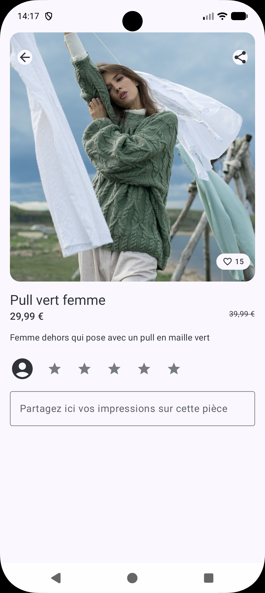
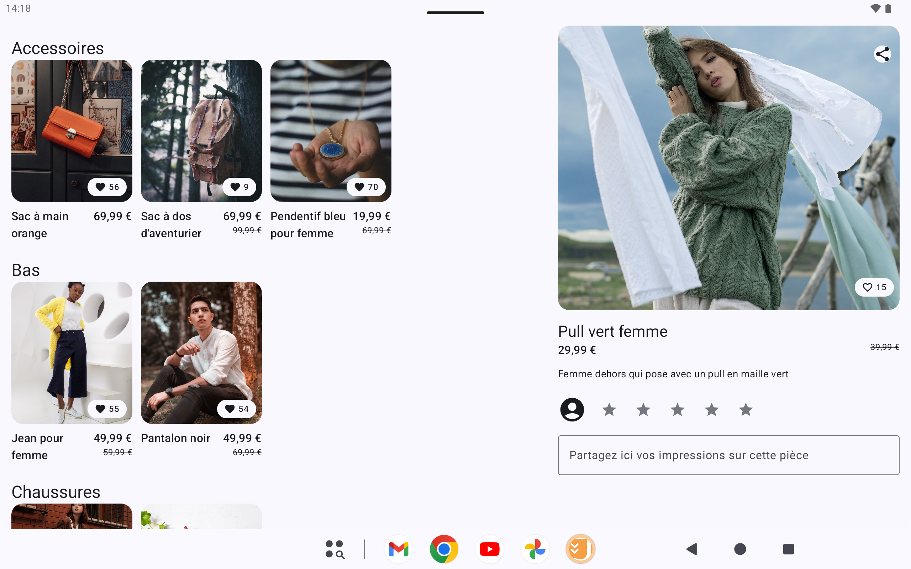

# Joiefull

Application Android (Kotlin / Jetpack Compose) pour **Joiefull**, une marque de mode. L'app permet de parcourir un catalogue d'articles (hauts, bas, chaussures, accessoires), de consulter le détail d'une pièce, de la noter, de la commenter, de l'ajouter à ses favoris et de la partager.

Projet réalisé dans le cadre du parcours **Développeur d'application Android** d'OpenClassrooms.

## Sommaire

- [Fonctionnalités](#fonctionnalités)
- [Captures d'écran](#captures-décran)
- [Architecture](#architecture)
- [Stack technique](#stack-technique)
- [Accessibilité](#accessibilité)
- [Adaptabilité tablette](#adaptabilité-tablette)
- [Installation](#installation)
- [Tests](#tests)
- [Structure du projet](#structure-du-projet)

## Fonctionnalités

- **Liste des articles** regroupés par catégorie (Hauts, Bas, Chaussures, Accessoires), avec photo, nom, prix (et prix barré en cas de promotion) et nombre de favoris.
- **Détail d'un article** : image en haute qualité et zoomable (pinch-to-zoom), description, prix, note moyenne.
- **Favoris** : ajout/suppression depuis la liste ou le détail, compteur mis à jour en temps réel.
- **Notation** par étoiles avec commentaire libre associé.
- **Partage** d'un article via le système de partage natif d'Android (bouton dédié sur l'écran de détail).
- **Vue maître-détail** sur tablette : liste à gauche, détail à droite, mise à jour dynamique selon la largeur d'écran disponible.

## Captures d'écran

| Accueil (téléphone) | Détail (téléphone) | Vue tablette |
|:---:|:---:|:---:|
|  |  |  |

## Architecture

L'application suit une architecture **MVVM** en couches :

```
UI (Jetpack Compose)  ↔  ViewModel (StateFlow)  ↔  Repository  ↔  Source de données (API distante)
```

- **`ui`** : écrans et composants Compose (`home`, `detail`, `navigation`, `components`), un `ViewModel` par écran exposant l'état via `StateFlow`.
- **`domain`** : modèles métier et interfaces de repository, indépendants de la source de données.
- **`data`** : implémentation des repositories, mapping DTO → modèle métier, accès réseau (`remote`).
- **`di`** : configuration de l'injection de dépendances (Hilt).

Les données créées côté utilisateur (favoris, note, commentaire) n'ayant pas de persistance côté API, elles sont gérées en mémoire via le repository dédié à l'état utilisateur, le temps de la session applicative.

La navigation entre l'accueil et le détail est gérée par état Compose simple (pas de librairie de navigation), afin de permettre l'affichage simultané des deux écrans en mode maître-détail sur tablette.

## Stack technique

- **Kotlin** + **Jetpack Compose** (Material 3)
- **Hilt** — injection de dépendances
- **Retrofit** + **Moshi** — appels réseau et parsing JSON
- **Coil** — chargement d'images
- **Coroutines / Flow** — asynchrone et gestion d'état
- **Compose Material3 Adaptive** (`WindowSizeClass`) — détection de la taille d'écran pour la vue maître-détail
- **JUnit** — tests unitaires (ViewModels, mappers, logique d'adaptation d'écran)

## Accessibilité

Un soin particulier a été apporté à l'accessibilité :

- Description systématique des images (`content description` fourni par l'API) et des icônes/boutons.
- Zones cliquables respectant une taille minimale confortable au toucher.
- Interface utilisable avec une taille de police système augmentée.
- Compatible **TalkBack** : ordre de lecture explicite entre les panneaux en vue maître-détail, annonce automatique du changement de contenu du panneau de détail.
- Vérifications régulières avec **Accessibility Scanner** tout au long du développement.

## Adaptabilité tablette

Sur les écrans suffisamment larges (breakpoint `EXPANDED` officiel de Google, 840dp), l'application bascule automatiquement en vue **maître-détail** : la liste des articles occupe la partie gauche de l'écran, le détail de l'article sélectionné s'affiche à droite. Sur téléphone, chaque écran occupe l'intégralité de l'espace disponible.

## Installation

### Prérequis

- Android Studio (dernière version stable)
- JDK 17
- SDK Android : `minSdk` 24, `compileSdk`/`targetSdk` 37

### Étapes

```bash
git clone https://github.com/Cklla/Joiefull-Android
cd Joiefull
./gradlew assembleDebug
```

Ouvrir le projet dans Android Studio et lancer l'application sur un émulateur ou un appareil physique. Une connexion internet est nécessaire au premier lancement pour récupérer le catalogue d'articles.

## Tests

```bash
./gradlew testDebugUnitTest
```

Les tests couvrent notamment les ViewModels, les mappers de données et la logique de détection du mode maître-détail (`WindowLayoutTest`).

## Structure du projet

```
app/src/main/java/com/openclassrooms/joiefull/
├── data/            # Repositories, mapping, accès réseau
├── di/              # Modules Hilt
├── domain/          # Modèles métier et interfaces de repository
└── ui/
    ├── components/  # Composants Compose réutilisables
    ├── detail/      # Écran de détail
    ├── home/        # Écran d'accueil
    ├── navigation/  # Navigation et adaptation tablette
    └── theme/       # Thème Material 3
```
